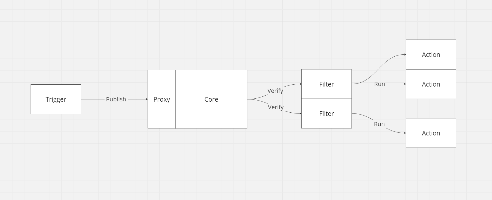

<h1>Cosmic Blueprint</h1>

<h3>
  🚧 Under construction... 🚧
</h3>

<p>Template for Back-End projects with Nodejs, Nestjs, Modular Monoliths and Domain Driven Design.</p>

# Table of Contents
- [Introduction](#introduction)
- [Current Versions](#current-versions)
- [Architecture](#architecture)
  - [Domain-Driven Design](#domain-driven-design)
  - [Event Bridge](#event-bridge)
- [Usage](#usage)
- [Tests](#tests)
- [Contribution](#contribution)
- [Additional Resources](#additional-resources)

# Introduction
This repository provides a basic framework for Back-End projects using technologies such as Nodejs, Nestjs and approaches such as Domain Driven Design, Event-Driven Architecture, monolithic modular architecture or microservices. Feel free to modify or contribute to this template.

# Current Versions
This template is based on:
- Nodejs v20.9.0
- Yarn v1.22.19
- Typescript v5.1.3
- Nestjs v10.0.0
- Express v4.18.2

# Architecture
## Domain-Driven Design


Domain-Driven Design (DDD) is a powerful and conceptually rich approach to software development, focused on building systems that faithfully reflect the complexity of the domain to which they belong. Introduced by Eric Evans in his seminal book "Domain-Driven Design: Tackling Complexity in the Heart of Software", DDD offers a set of principles, patterns and practices designed to effectively align source code with the nuances and intricate business rules of a given domain. See more [here](https://martinfowler.com/bliki/DomainDrivenDesign.html).

## Event Bridge


Event Bridge is the application's ***Events*** router. It is responsible for receiving ***Events*** from one or more points of origin (***Triggers***) and matching them with the ***Actions*** registered based on ***Topics***. It can be used to communicate between application components or to communicate with external systems.

- ***Event*** is something important that occurs in the system and other components care about it, for example: New user registered, Order confirmed etc...

- A ***Topic*** tells us what type of ***Event*** is being published, it is through this that the Event Bridge knows which ***Actions*** should be executed. Every topic is made up of two parts: the main topic and the subtopic, for example: "Accounts.Created". You can also register actions with wildcard topics, for example: "Accounts.*".

- A ***Trigger*** can be any function that can publish an **Event** to the Event Bridge. This opens up the possibility of publishing ***Events** from anywhere in the application, either by calling it directly from a use case or through a job implementing the [Transactional Outbox](https://microservices.io/patterns/data/transactional-outbox.html) pattern, for example.

- ***Proxy*** is the layer responsible for validating the structure of the ***Event***, such as the format of the ***Topic***. When this data is valid, the ***Event*** is passed on to the ***Core*** component.

- ***Core*** is the layer responsible for effectively handling the registration of actions and publications, applying all the logic necessary to satisfy the flow of ***Events***.

- ***Action*** is a function that receives the published event and can be used to perform any operation required, from business rule flows to integrations with external systems, for example: publishing the event in a queue that will be consumed by other systems or sending a notification of something that has happened via Slack, email or SMS.

- ***Filters*** are optional validators that can be defined when an ***Action*** is registered. The ***Filters*** receive the data from the published ***Event*** and through it you can perform checks to execute ***Actions*** only when certain conditions are met. Let's look at the following ***Event***:

  ```json
    {
      "topic": "Accounts.Created",
      "message": {
        "name": "John Doe",
        "phone": "+5519999999999",
        "email": null
      }
    }
  ```

  In this example, the user provides a phone number but not an email (the opposite could also be possible), with filters you can create a rule where the ***Action*** that sends the welcome email will only be executed if the user has provided an email.

# Usage

# Tests

# Contribution

# Additional Resources
